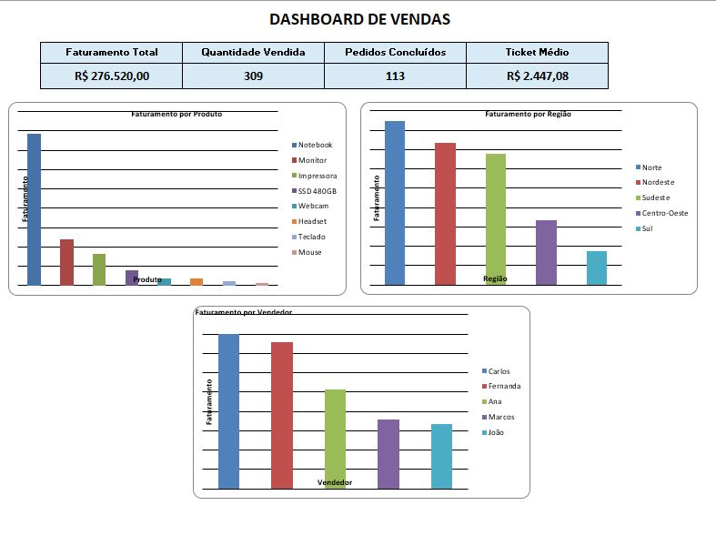
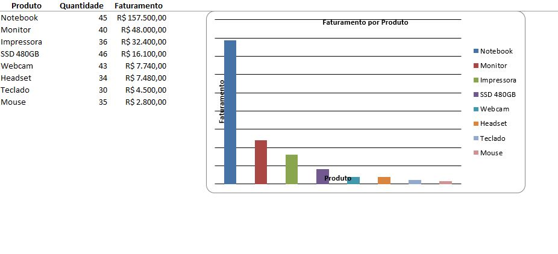

# 📊 Automação de Relatório de Vendas — Python + Excel

Projeto de automação desenvolvido em **Python** para validação, análise e geração de relatórios de vendas a partir de uma base de dados em Excel.

O sistema simula um cenário empresarial no qual os dados passam por **validação, análise de indicadores e geração automática de um relatório gerencial em Excel**, incluindo Dashboard, tabelas analíticas e gráficos.

## 📌 Sobre o Projeto

O projeto foi desenvolvido para automatizar um fluxo de análise de vendas, reduzindo etapas manuais no tratamento dos dados e facilitando a geração de informações gerenciais.

A solução realiza o processamento desde a criação e validação da base até a geração do relatório final, seguindo o fluxo:

**Base de Vendas → Validação → Análise → Relatório Excel → Dashboard**

O projeto também demonstra a aplicação prática de **Python, Pandas, OpenPyXL e Excel** em um cenário de análise e automação de processos.

## 🎯 Objetivos

* Automatizar o processamento de uma base de vendas.
* Validar a qualidade e consistência dos dados.
* Identificar possíveis inconsistências antes da análise.
* Calcular indicadores comerciais.
* Analisar vendas por diferentes dimensões.
* Automatizar a geração de relatórios em Excel.
* Criar gráficos e Dashboard gerencial.
* Organizar o projeto de forma modular.
* Demonstrar conhecimentos de Python, análise de dados e automação de processos.

## ⚙️ Funcionalidades

### 📥 Criação da Base

* Geração de uma base de vendas simulada.
* Registro de data, pedido, produto e categoria.
* Registro de região e vendedor.
* Registro de quantidade e preço unitário.
* Cálculo do faturamento.
* Registro da forma de pagamento.
* Registro do status do pedido.
* Salvamento automático em `dados/vendas.xlsx`.

### ✅ Validação dos Dados

O sistema realiza verificações automáticas antes da análise:

* Campos obrigatórios.
* Campos preenchidos.
* Datas válidas.
* Quantidades.
* Preços.
* Cálculo do faturamento.
* Pedidos duplicados.
* Status dos pedidos.
* Formas de pagamento.

Essa etapa permite verificar a consistência da base antes da geração dos indicadores.

### 📊 Análise das Vendas

O sistema calcula e analisa:

* Faturamento total.
* Quantidade vendida.
* Total de pedidos.
* Pedidos concluídos.
* Pedidos cancelados.
* Ticket médio.
* Faturamento por produto.
* Faturamento por região.
* Faturamento por vendedor.
* Evolução mensal das vendas.
* Produtos com baixo volume.

Para os indicadores de vendas realizadas, são considerados apenas os pedidos com status **Concluído**.

### 📋 Relatório em Excel

O sistema gera automaticamente o arquivo:

`relatorios/relatorio_vendas.xlsx`

O relatório contém as seguintes abas:

* Dashboard
* Resumo
* Por Produto
* Por Região
* Por Vendedor
* Por Pagamento

Além das tabelas analíticas, o relatório possui gráficos para facilitar a visualização dos resultados.

### ⚙️ Automação do Processo

O arquivo `gerar_relatorio.py` funciona como o **orquestrador do projeto**.

A execução centraliza as etapas:

**Validação → Análise → Geração do Relatório → Atualização do Dashboard**

Dessa forma, não é necessário executar cada etapa manualmente.

## 💻 Tecnologias Utilizadas

| Tecnologia    | Aplicação                                   |
| ------------- | ------------------------------------------- |
| 🐍 Python     | Desenvolvimento e automação                 |
| 🐼 Pandas     | Manipulação e análise dos dados             |
| 📗 OpenPyXL   | Criação e formatação dos arquivos Excel     |
| 📊 Excel      | Armazenamento e apresentação dos resultados |
| 📁 Pathlib    | Gerenciamento de caminhos e arquivos        |
| ⚙️ Subprocess | Orquestração da execução dos processos      |
| 🔧 Git        | Controle de versão                          |
| 🌐 GitHub     | Hospedagem do projeto                       |

## 🗄️ Estrutura de Dados

A base principal está localizada em:

`dados/vendas.xlsx`

Os dados utilizados no projeto possuem campos relacionados a:

* Data da venda
* Pedido
* Produto
* Categoria
* Região
* Vendedor
* Quantidade
* Preço Unitário
* Faturamento
* Forma de Pagamento
* Status

O processamento considera os dados da base para realizar validações, análises e geração dos indicadores.

## 📁 Estrutura do Projeto

```text
Automacao_Relatorio_Vendas/
│
├── dados/
│   └── vendas.xlsx
│
├── imagens/
│   ├── dashboard_vendas.png
│   └── relatorio_vendas.png
│
├── relatorios/
│   └── relatorio_vendas.xlsx
│
├── src/
│   ├── criar_base.py
│   ├── validar_dados.py
│   ├── analisar_vendas.py
│   ├── gerar_relatorio.py
│   └── gerar_excel.py
│
├── .gitignore
└── README.md
```

### 📄 Organização dos Arquivos

**`criar_base.py`**
Responsável pela criação da base de vendas simulada.

**`validar_dados.py`**
Realiza as validações de consistência e qualidade dos dados.

**`analisar_vendas.py`**
Executa os cálculos dos indicadores e análises comerciais.

**`gerar_relatorio.py`**
Orquestra as etapas de validação, análise e geração do relatório.

**`gerar_excel.py`**
Cria e organiza o relatório final em Excel, incluindo tabelas, indicadores e gráficos.

**`dados/vendas.xlsx`**
Base de dados utilizada pelo sistema.

**`relatorios/relatorio_vendas.xlsx`**
Relatório gerencial gerado automaticamente.

**`imagens/`**
Contém imagens utilizadas na documentação do projeto.

## 🔄 Fluxo do Sistema

```text
┌──────────────────────┐
│   Base de Vendas     │
│      Excel           │
└──────────┬───────────┘
           │
           ▼
┌──────────────────────┐
│ Validação dos Dados  │
│ Campos / Datas /     │
│ Valores / Duplicados │
└──────────┬───────────┘
           │
           ▼
┌──────────────────────┐
│ Análise das Vendas   │
│ KPIs / Produtos /    │
│ Regiões / Vendedores │
└──────────┬───────────┘
           │
           ▼
┌──────────────────────┐
│ Geração do Relatório │
│        Excel         │
└──────────┬───────────┘
           │
           ▼
┌──────────────────────┐
│ Dashboard + Gráficos │
└──────────────────────┘
```

## 🖼️ Demonstração

### 📊 Dashboard de Vendas



### 📋 Relatório de Vendas



## 🚀 Como Executar o Projeto

### 1. Pré-requisito

É necessário ter o **Python instalado**.

### 2. Instalar as dependências

Abra o terminal na pasta principal do projeto e execute:

```bash
pip install pandas openpyxl
```

### 3. Executar o sistema

Execute:

```bash
python src/gerar_relatorio.py
```

O sistema realizará automaticamente:

```text
1. Validação dos dados
2. Análise das vendas
3. Geração do relatório Excel
4. Atualização do Dashboard
```

O relatório será gerado em:

```text
relatorios/relatorio_vendas.xlsx
```

## 📈 Indicadores Gerados

O Dashboard apresenta os principais indicadores do período analisado:

* **Faturamento Total:** R$ 276.520,00
* **Quantidade Vendida:** 309
* **Pedidos Concluídos:** 113
* **Ticket Médio:** R$ 2.447,08

Também são disponibilizadas análises de:

* Faturamento por produto.
* Faturamento por região.
* Faturamento por vendedor.
* Formas de pagamento.
* Evolução mensal das vendas.
* Produtos com baixo volume.

## 🧠 Conceitos Demonstrados

* Python
* Manipulação de dados
* Pandas
* Validação de dados
* Tratamento de informações
* Análise de dados
* Indicadores de desempenho
* Automação de processos
* Geração de relatórios
* Excel
* OpenPyXL
* Criação de gráficos
* Organização modular de projetos
* Orquestração de processos
* Git e GitHub

## 🔮 Possíveis Evoluções

Como possíveis evoluções futuras, o projeto pode receber:

* Integração com banco de dados.
* Importação de dados de diferentes fontes.
* Novas validações de qualidade.
* Novos indicadores comerciais.
* Filtros adicionais no relatório.
* Automatização de atualizações periódicas.
* Integração com outras ferramentas de análise.
* Interface para execução do processo.

Essas funcionalidades não fazem parte da versão atual do projeto.

## 💼 Objetivo Profissional

Este projeto faz parte do portfólio de transição profissional para a área de **Tecnologia da Informação**, com foco em:

* Análise de Sistemas.
* Análise de Dados.
* Automação de Processos.
* Tratamento e validação de informações.
* Geração de relatórios.
* Indicadores de desempenho.
* Apoio à tomada de decisão.

O projeto demonstra a aplicação prática de conhecimentos técnicos em um cenário empresarial de análise e automação de dados.

## 👨‍💻 Autor

**Fernando Bueno**

🎓 Engenheiro de Computação
💻 Em transição para a área de Tecnologia da Informação

### 🔗 Contato

[](https://www.linkedin.com/in/fernando-cesar-bueno/)

[](https://github.com/BuenoFernando)
